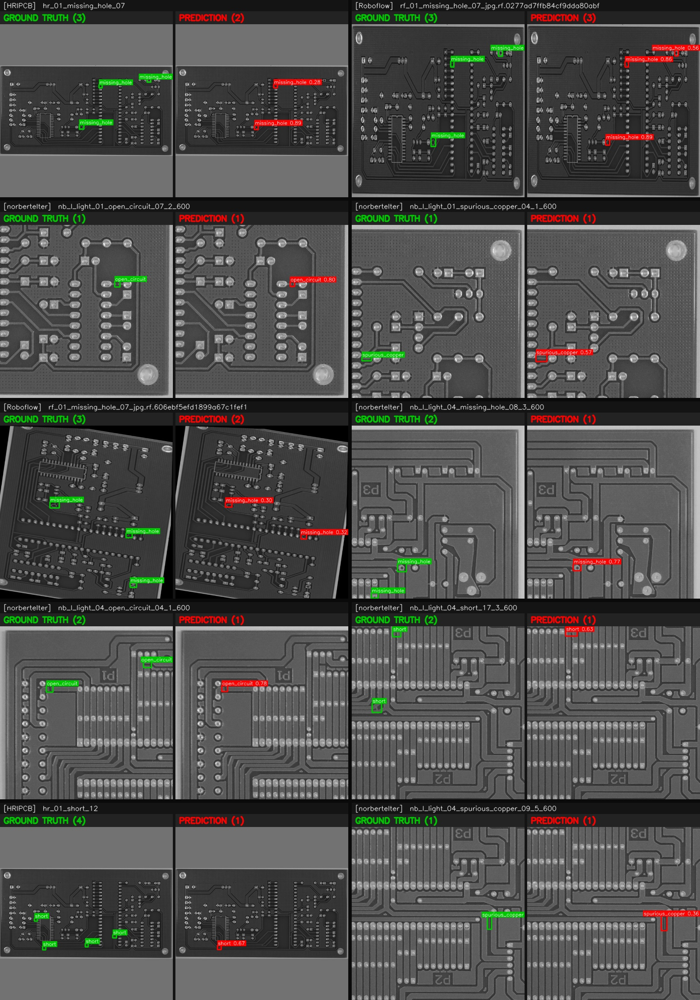
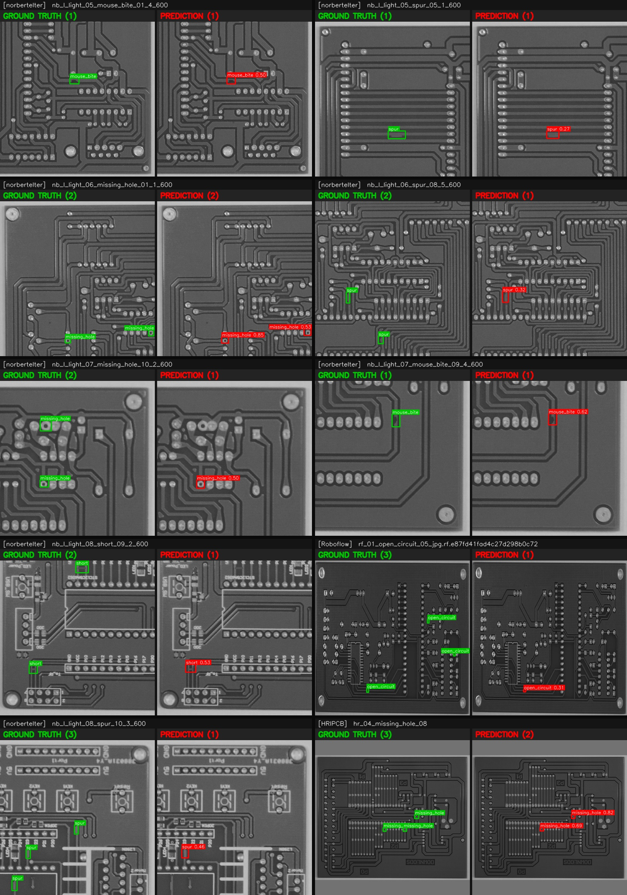
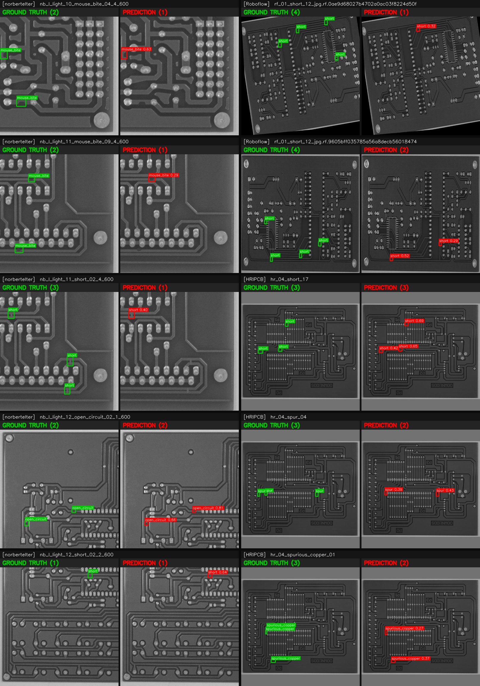
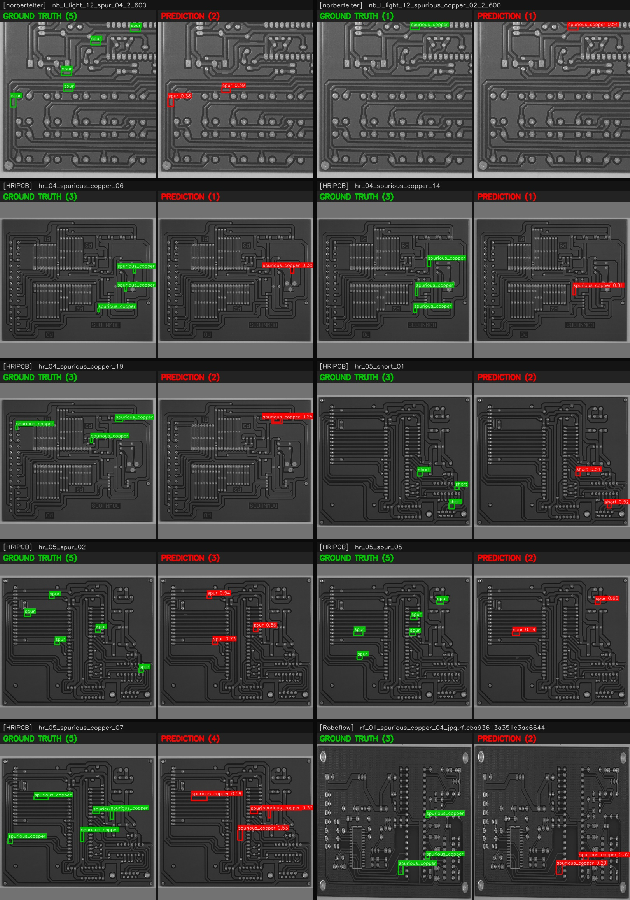
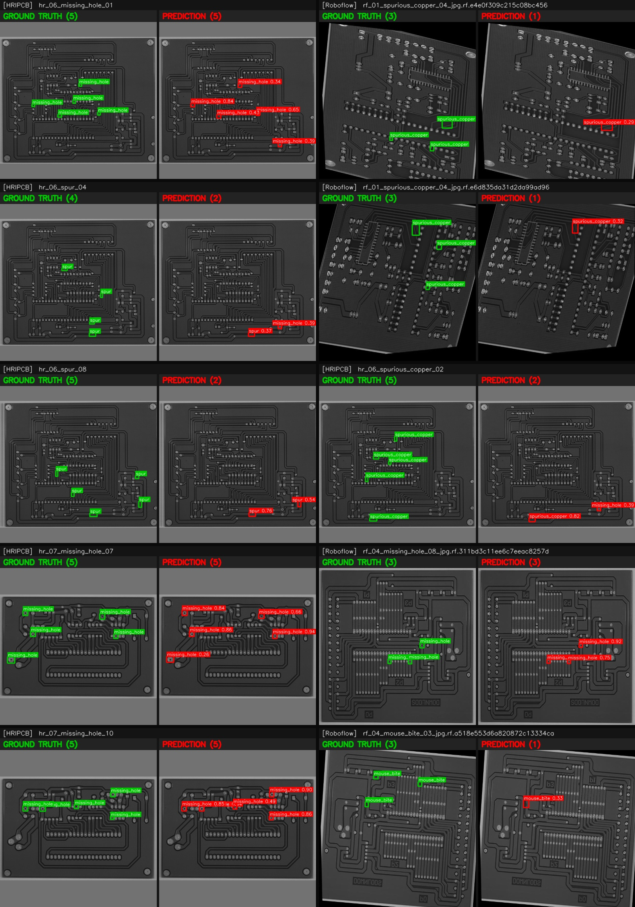

# PCB Defect Detector — Model Report

YOLOv3 (transfer-learned) for 6 PCB defect classes, exported for Intel FPGA AI Suite
(Agilex 7 F-series). Generated by `yolov3/make_report.py`.

## Headline

| Metric | Value |
|--------|-------|
| **mAP@0.5 (test)** | **0.408** (current baseline) |
| Test images | 1286 (held-out, never seen in training) |
| Defect instances (test) | 2621 |
| Classes | missing_hole, mouse_bite, open_circuit, short, spur, spurious_copper |
| Training so far | 7 epochs, frozen backbone, stock anchors, Colab T4 (stopped early on timeout) — pre-improvements baseline |

## Accuracy by class

| Class | Ground truths | Predictions | AP@0.5 |
|-------|--------------:|------------:|-------:|
| missing_hole | 332 | 328 | 0.606 |
| mouse_bite | 421 | 239 | 0.340 |
| open_circuit | 307 | 240 | 0.468 |
| short | 430 | 296 | 0.472 |
| spur | 685 | 264 | 0.267 |
| spurious_copper | 446 | 294 | 0.299 |

## How much it has trained

7 epochs, frozen backbone, stock anchors, Colab T4 (stopped early on timeout) — pre-improvements baseline

mAP is reported on the **held-out test split** (boards never seen in training, in any
augmentation), so it's an honest generalization estimate, not a memorized score.

## Expected improvement with more training

The biggest accuracy levers, roughly in order of impact:

1. **Full training to convergence + backbone unfreeze.** A frozen-backbone warm-up only
   adapts the detection heads; unfreezing lets the Darknet features adapt to the
   grayscale-PCB domain (far from COCO). This is usually the single largest gain.
2. **k-means anchors** (implemented; mean box↔anchor IoU 0.63→0.77, applied from the next
   run) mainly help the smallest classes (`spur`, `spurious_copper`) where recall lags.
3. **More data + augmentation** (DeepPCB added to train; online flips/rotation/brightness)
   improve robustness and reduce overfitting.

For HRIPCB-class PCB defect detection, well-trained YOLOv3 models typically reach
**~0.60–0.80 mAP@0.5**. Treat that as a target range, not a guarantee — the realized
number depends on convergence, and `spur`/`spurious_copper` recall is the part to watch.
Compare any new run directly against the **0.408** baseline since val/test are
unchanged.

## Sample predictions (test set)

Each sample is a pair: **left = ground truth (green)**, **right = model prediction (red,
with class + confidence)**. Defect type is labeled on every box. Balanced across the
source datasets (`[Source]` tag on each). Shown in chunks of 10 for readability.

**Samples 1–10:**

**Samples 11–20:**

**Samples 21–30:**

**Samples 31–40:**

**Samples 41–50:**

---
*Regenerate anytime: `python yolov3/make_report.py --ir <…>.xml --data <dataset> --classes <…> --trained "<note>"`.*
