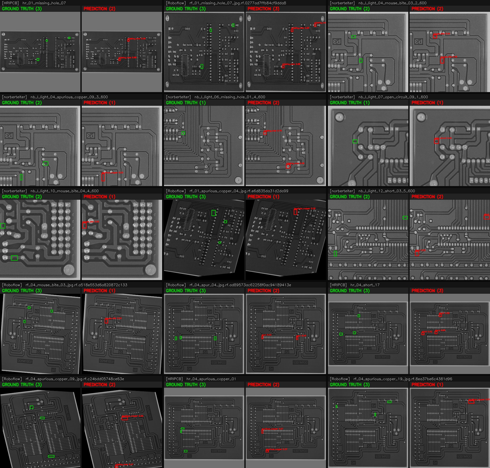

# PCB Defect Detector — Model Report

A YOLOv3 object detector for printed-circuit-board defects, trained by transfer learning
and exported for the **Intel FPGA AI Suite** (Agilex 7 F-series). This report covers the
current model's accuracy, sample predictions, how to continue the work across machines,
and how the architecture relates to standard YOLOv3.

---

## 1. Current status

| | |
|---|---|
| Dataset | `unified_pku_yolo_gray640` — 13,164 grayscale 640×640 images, 6 PCB defect classes |
| Classes | `missing_hole, mouse_bite, open_circuit, short, spur, spurious_copper` |
| Training | transfer learning, Darknet-53 backbone **frozen**, ~7 epochs (cut short by Colab timeouts) |
| **Test mAP@0.5** | **0.408** (1,286 held-out images, group-aware split — no train/val leakage) |
| Deployment artifact | `yolov3_fpga_fp32.{xml,bin}` — raw conv-head OpenVINO IR for the DLA |

This is an **early baseline**, not the finished model: only the detection heads have
trained, on a frozen backbone, for a handful of epochs. The phase-2 fine-tune (unfreeze
the backbone) and more epochs are expected to raise mAP substantially.

---

## 2. Evaluation

Per-class average precision at IoU 0.5, evaluated on the FP32 FPGA IR with host-side
decode (numerically identical to the full TensorFlow model):

| Class | Ground truths | Predictions | AP@0.5 |
|-------|--------------:|------------:|-------:|
| missing_hole | 332 | 328 | **0.606** |
| short | 430 | 296 | 0.472 |
| open_circuit | 307 | 240 | 0.468 |
| mouse_bite | 421 | 239 | 0.340 |
| spurious_copper | 446 | 293 | 0.297 |
| spur | 685 | 264 | 0.266 |
| **mAP@0.5** | | | **0.408** |

**Reading it:** the model is strongest on `missing_hole` (a large, distinctive feature)
and weakest on `spur`/`spurious_copper` (tiny, easily confused). Notice the *Predictions*
column is well below *Ground truths* for the small classes (e.g. spur: 264 found vs 685
present) — the model is **under-detecting tiny defects**. That's the expected symptom of
(a) only 7 epochs on a frozen backbone, and (b) using stock COCO anchors that are far
larger than PCB defects. Both are addressable (more training; k-means anchors).

### Sample predictions

Each sample is a **pair of panels**: the **left** panel shows the **ground truth** (green
boxes = correct defect locations); the **right** panel shows the **model's prediction**
(red boxes + class/confidence) on the same image. Compare left vs right — a green box on
the left with no matching red box on the right is a **missed defect**; a red box with no
green counterpart is a **false positive**.

All samples are from the **held-out test set** (boards never seen in training, in any
augmentation), and are **balanced across the three merged source datasets** — each panel's
title bar is tagged `[HRIPCB]`, `[norbertelter]`, or `[Roboflow]` so you can see the model
generalizing across sources (the Roboflow boards even look visually distinct).



Regenerate with:
```bash
./.venv-train/bin/python scripts/make_report_samples.py \
    --ir runs/unified_pku_yolo_gray640/openvino_fpga/yolov3_fpga_fp32.xml \
    --data datasets/unified_pku_yolo_gray640 --split test \
    --classes runs/unified_pku_yolo_gray640/openvino_fpga/classes.txt --out docs/eval_samples.jpg
```

---

## 3. Continuing the work across machines

State is synced through **Google Drive** (dataset zip + latest `*_yolov3_best.weights.h5`),
so Colab, a local Mac, or a dedicated GPU box all resume from the same checkpoint via
`train_yolov3.py --resume`. Full commands are in [TRAINING.md](TRAINING.md); the short
version for an NVIDIA GPU box (e.g. H100):

```bash
git clone https://github.com/EasonLi292/PCB_yolov3.git && cd PCB_yolov3
python3.12 -m venv .venv-train && ./.venv-train/bin/pip install -r requirements-train.txt
# pull dataset zip + checkpoint from Drive (rclone / gdown / scp), unzip into datasets/
./.venv-train/bin/python scripts/train_yolov3.py --data datasets/unified_pku_yolo_gray640 \
    --resume runs/.../yolov3_best.weights.h5 --epochs 30 --batch 32          # phase 1 (frozen)
./.venv-train/bin/python scripts/train_yolov3.py --data datasets/unified_pku_yolo_gray640 \
    --resume runs/.../yolov3_best.weights.h5 --unfreeze --lr 1e-4 --epochs 20 --batch 32  # phase 2
./.venv-train/bin/python scripts/export_fpga.py --weights runs/.../yolov3_best.weights.h5 \
    --out runs/.../openvino_fpga --nc 6                                        # FPGA IR
```

An H100 finishes phase 1 + 2 in well under an hour (no Colab timeout), so the next run
should produce a properly-converged model rather than the 7-epoch baseline above.

---

## 4. YOLOv3 in brief

YOLOv3 ("You Only Look Once", v3) is a **single-stage** object detector — it predicts all
boxes and classes in **one forward pass** over the image (unlike two-stage detectors that
first propose regions, then classify them). The pieces:

- **Backbone — Darknet-53:** a 53-layer convolutional network (3×3/1×1 convs, batch-norm,
  LeakyReLU, residual connections) that extracts a feature pyramid from the image.
- **Grid + anchors:** the image is divided into a grid; each cell predicts boxes relative
  to a small set of preset box shapes called **anchors**. The network only learns to
  *adjust* an anchor (shift its center, scale its size), which is easier than predicting a
  box from nothing.
- **3 detection scales:** YOLOv3 predicts at three resolutions (for a 640² input: 80×80,
  40×40, 20×20 grids) with 3 anchors each — the fine grid catches small objects, the coarse
  grid catches large ones. That's 9 anchors total.
- **Per-box output:** for each anchor at each cell the network outputs
  `(tx, ty, tw, th, objectness, class scores…)` — box offset/scale, a confidence that an
  object is present, and class probabilities.
- **Decode + NMS (post-processing):** raw outputs are turned into pixel boxes
  (sigmoid on xy/objectness, `exp` on wh × anchor), then **non-maximum suppression** removes
  overlapping duplicates.

---

## 5. How this model deviates from standard YOLOv3

The **core architecture is unchanged** — Darknet-53 backbone + 3-scale FPN heads. The
deviations are at the input, the output head, and the deployment boundary:

| Aspect | Standard YOLOv3 | This model | Why |
|--------|-----------------|------------|-----|
| **Classes / head width** | 80 (COCO); `3×(5+80)=255` filters per head | **6**; `3×(5+6)=33` filters per head | Only 6 PCB defect types — the 3 detection heads are **redefined and retrained**. |
| **Input channels** | 3-channel RGB | **Single-channel grayscale**, tiled to 3ch at the input | PCB inspection images are black-and-white; tiling to 3ch keeps the pretrained RGB backbone valid. |
| **Input size** | 416² (or any multiple of 32) | Fixed **640²** | Larger input helps tiny defects; fixed shape is required by the FPGA DLA. |
| **Decode + NMS** | Baked into the model's forward pass | **Stripped from the graph** — the exported IR emits only the 3 raw conv heads; decode + NMS run on the host (`scripts/yolo_postprocess.py`) | The Agilex DLA maps conv/BN/LeakyReLU/upsample/concat cleanly but not `exp`/grid/NMS ops; keeping those on the host gives one clean convolutional subgraph for the FPGA. |
| **Training** | trained on COCO from scratch / ImageNet backbone | **Transfer learning**: COCO Darknet-53 backbone + FPN necks reused, heads trained fresh; optional backbone fine-tune | Small dataset — reuse pretrained features instead of learning them from scratch. |
| **Anchors** | k-means anchors computed on the target dataset | **Stock COCO anchors** (unchanged, for now) | A known suboptimality for tiny PCB defects — deferred; anchors live in host post-processing, so swapping them later has **zero FPGA impact**. |

**Net:** it *is* YOLOv3 — same backbone, same 3-scale anchor-based heads, same loss. What
changed is the I/O (grayscale in, 6-class heads out) and a deliberate **split of the
graph** so the convolutional core runs on the FPGA DLA while the lightweight decode/NMS
runs on the host CPU.

---

*Generated from commit weights `yolov3_best.weights.h5` (7-epoch baseline). Re-run
`scripts/analyze_openvino.py` and `scripts/make_report_samples.py` after the full training
to refresh the numbers and montage.*
