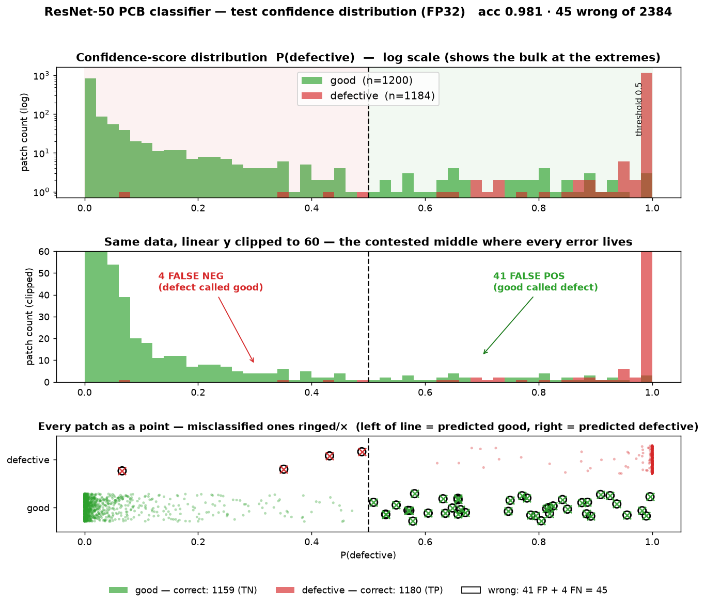
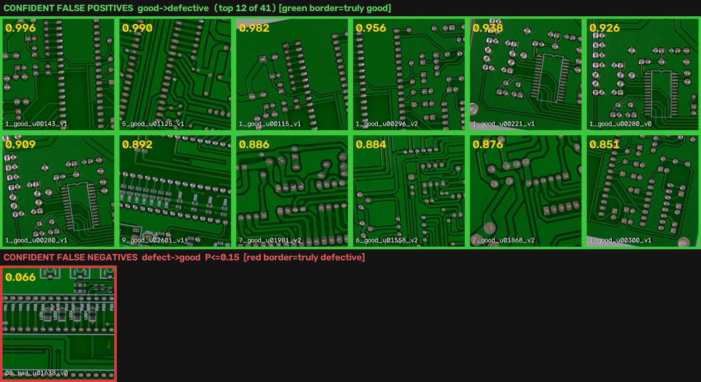

# ResNet-50 PCB Classifier — Confidence-Score Distribution

How the model's output `P(defective)` is distributed across the test set
(`datasets/pcb_patches/test`, 2,384 patches, FP32), color-coded by true class and by
whether the prediction is correct. Companion to [`MODEL_REPORT.md`](MODEL_REPORT.md).

**Color key:** 🟩 green = truly **good**, 🟥 red = truly **defective**. Dashed line = the
0.5 decision threshold. Good patches *should* sit near 0, defective near 1.

## Reading the three panels

1. **Log histogram (top)** — shows the full shape. The two classes are almost completely
   separated and pile up at the extremes: good against 0, defective against 1. The shaded
   tints mark the "wrong side" of the threshold for each class.
2. **Linear, clipped to 60 (middle)** — the spikes at 0 and 1 run off-chart on purpose so
   the **contested middle** is legible. This is the only region where errors can occur;
   the arrows point at the 4 false negatives (defect scored < 0.5) and the 41 false
   positives (good scored ≥ 0.5).
3. **Per-patch strip (bottom)** — every test patch as one dot at its score, good on the
   lower row, defective on the upper. Correct predictions are faint dots; **misclassified
   patches are ringed and ×-marked** so you can spot exactly where and how many.

## What the distribution says

| | mean | median | piled at its correct extreme |
|---|---|---|---|
| **good** (🟩) | 0.059 | 0.005 | 86.5 % score < 0.1 |
| **defective** (🟥) | 0.994 | 1.000 | 98.5 % score > 0.9 |

- **The model is decisive, not hedging.** Almost every patch lands within 0.1 of 0 or 1;
  only **172 of 2,384 patches (7 %)** fall in the contested 0.1–0.9 band — and that band
  is **155 good vs. 17 defective**, i.e. the uncertainty is overwhelmingly on the good
  side (the model second-guesses clean patches far more than defective ones).
- **Errors live at the boundary, and they're lopsided the safe way.** All 45 mistakes
  (41 FP + 4 FN) sit near 0.5. Because false alarms (good→defect) outnumber misses
  (defect→good) **10 : 1**, the failure mode is *over-cautious* — the right direction for
  a screen whose expensive mistake is shipping a bad board.
- **The 4 missed defects barely cross the line.** Three score 0.35–0.49 (a lower
  threshold recovers them); only one is a confident miss at 0.066. See
  [`false_negatives.jpg`](false_negatives.jpg).
- **Well-conditioned for lower precision.** With scores this far from 0.5, FP16 moved only
  2 predictions ([`MODEL_REPORT_FP16.md`](MODEL_REPORT_FP16.md)) — the wide margin is why
  precision reduction is nearly free here.

## Where the model is *confidently* wrong

Most errors hedge near 0.5, but a few are confident — those are the informative ones.
Only **7 false positives score ≥ 0.90** and **exactly 1 false negative scores ≤ 0.15**.

**Confident false positives (clean → sure it's defective).** These "good" patches come
from the **healed clean plates**, so they are defect-free *by construction* — this is not
label noise. The model is genuinely fooled by clean structures that mimic defect
morphology:

- isolated copper stubs / trace terminations (0.996, 0.982) → look like a **spur** /
  **spurious_copper**;
- tightly-spaced parallel traces and IC pin arrays (0.990, 0.892) → look like a **short**;
- trace corners and via clusters (0.956, 0.938) → resemble **mouse-bite** / **open-circuit**.

Two signs it's *systematic*, not random noise:
1. **Template 01 dominates** — 7 of the top 12 confident FPs are `tpl_01`; that layout has
   a motif the model reliably misreads.
2. **Jitter siblings fail together** — `u00280_v0` (0.926) and `u00280_v1` (0.909) are the
   same region shifted a few pixels, both confidently wrong. Noise would scatter; the
   *feature itself* triggers it.

The root cause is inherent to a context-free patch classifier: it has over-learned the
local "copper-blob / gap / bridge" shapes and can't see enough surrounding board to tell a
*designed* trace-end from a *spur*.

**The one confident miss (P = 0.066).** `tpl_08_bad_u01638_v0` is an LED/pad-array region —
a long row of near-identical pads where the real defect hides in the repetition. Its jitter
sibling `u01638_v3` scored 0.432 (nearly caught), so it sits right at the visibility floor
rather than being a gross failure.

**Fixing the confident errors is a data lever, not a threshold one** (they're at 0.9+, far
from 0.5): feed these exact clean-but-defect-like regions back as **hard negatives**, add
more template-01 clean variety, and give subtle defects more signal in-frame (tighter crop
/ larger `--save-size`).

## Practical takeaway

The clean bimodal separation means the 0.5 threshold is not
delicate — you can slide it toward 0.4 to catch the borderline misses (trading a few more
false alarms) or toward 0.7 to cut false alarms (barely touching recall), and the sweep
in [`MODEL_REPORT.md`](MODEL_REPORT.md) quantifies each choice. The **confident** errors,
however, won't move with the threshold — they need harder training data.

*Reproduce:* run `eval_resnet.py` to get per-patch scores, then plot `P(defective)`
histograms split by label. Figure: `resnet/confidence_distribution.png`.
