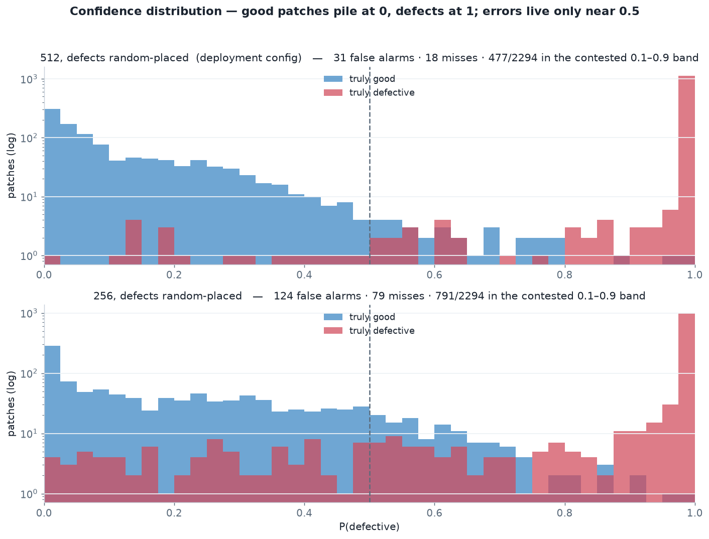

# ResNet-50 PCB Classifier — Confidence-Score Distribution

How the model's output `P(defective)` is distributed across the test set, by true class.
Companion to [`MODEL_REPORT.md`](MODEL_REPORT.md). All numbers are the **v3 in-distribution**
run (2,294 test patches: 1,110 good / 1,184 defective), with defects **placed randomly** in the
tile — the realistic "defect could be anywhere" regime. Two configs shown: the **512 deployment
model** and **256** for contrast.

**Color key:** 🟦 blue = truly **good**, 🟥 red = truly **defective**. Dashed line = the 0.5
decision threshold. Good patches *should* sit near 0, defective near 1.

## What the distribution says

| config | good mean | bad mean | good < 0.1 | bad > 0.9 | contested 0.1–0.9 (good / bad) | FP / FN @0.5 |
|---|---|---|---|---|---|---|
| **512 offset** (deployment) | 0.127 | 0.981 | 60.6% | 96.4% | 477 (435 / 42) | 31 / 18 |
| 512 centered | 0.023 | 0.994 | 95.1% | 99.0% | 63 (53 / 10) | 7 / 6 |
| 256 offset | 0.215 | 0.926 | 41.5% | 86.3% | 791 (645 / 146) | 124 / 79 |

- **The model is decisive, not hedging.** Even in the hardest case (256, random placement), the
  defective class piles hard against 1 (86% score > 0.9). At 512 the two classes are almost
  completely separated — only 477 of 2,294 patches fall in the contested 0.1–0.9 band, and just 63
  when defects are centered.
- **Errors live at the boundary, and they're lopsided the safe way.** In the 512 deployment model
  the contested band is **435 good vs. 42 defective** — the uncertainty is ~10× more on the good
  side. The model second-guesses clean patches far more than defective ones, so the failure mode is
  **over-cautious** (31 false alarms vs. 18 misses) — the right direction for a screen whose
  expensive mistake is shipping a bad board.
- **Random placement is what widens the good lobe.** Going centered→offset lifts the good mean
  0.023→0.127 (512) and 0.076→0.215 (256): a defect at the tile edge leaves some BAD tiles
  mostly-clean, so the model grows warier of genuinely clean tiles. Resolution counteracts it —
  512-offset (477 contested) is still tighter than 256-*centered* (251) would suggest is easy.

## Where the model is confidently wrong

The confident false positives are **clean patches from the healed plates** (defect-free *by
construction* — not label noise) whose local morphology mimics a defect: isolated copper stubs and
trace terminations read as **spur / spurious_copper**; tightly-spaced parallel traces and IC pin
arrays read as **short**; via clusters resemble **mouse-bite / open-circuit**. The root cause is
inherent to a **context-free patch** classifier — it has over-learned the local copper-blob / gap /
bridge shapes and can't see enough surrounding board to tell a *designed* trace-end from a *spur*.
This is a **data lever, not a threshold one** (these sit at 0.9+, far from 0.5): feed the exact
clean-but-defect-like regions back as **hard negatives**.

The confident misses are the smallest defects downscaled into a busy frame — a real 40–60 px defect
becomes ~15 px in the tile and a handful of pixels at 256 train size. The lever is more defect
signal in-frame (larger input / tighter crop) — which is exactly why **512 more than halves the
misses** (18 vs. 79 at 256), and why the [resolution analysis](MODEL_REPORT.md#7-resolution--and-why-256-is-not-obsolete)
matters.

## Practical takeaway

The clean bimodal separation means the 0.5 threshold is not delicate — slide toward 0.4 to catch
borderline misses (a few more false alarms) or toward 0.7 to cut false alarms (barely touching
recall); the sweep in [`MODEL_REPORT.md`](MODEL_REPORT.md) quantifies each choice. The **confident**
errors won't move with the threshold — they need harder training data (hard negatives) and more
in-frame defect signal.

*Reproduce:* run `eval_resnet.py` for per-patch scores, or the scorer that produced
`resnet/details/confidence_v3.json`; figure `resnet/figures/confidence_distribution_v3.png`.
