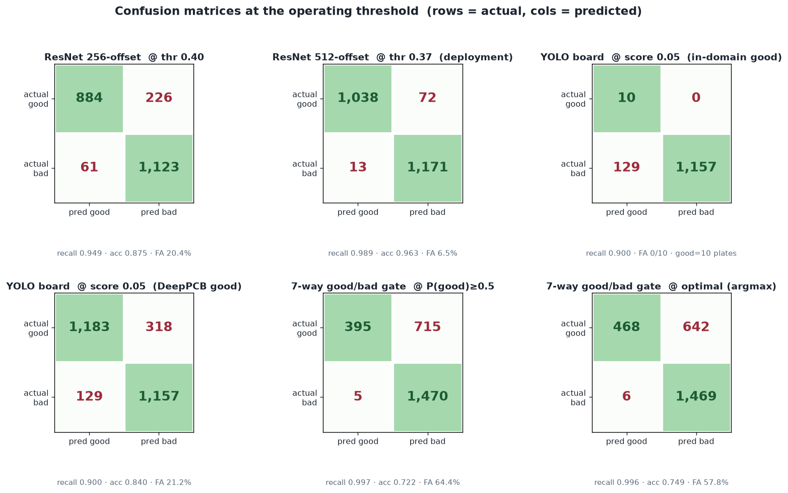
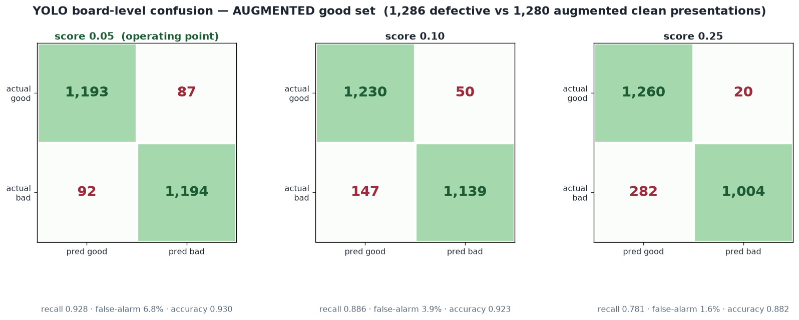
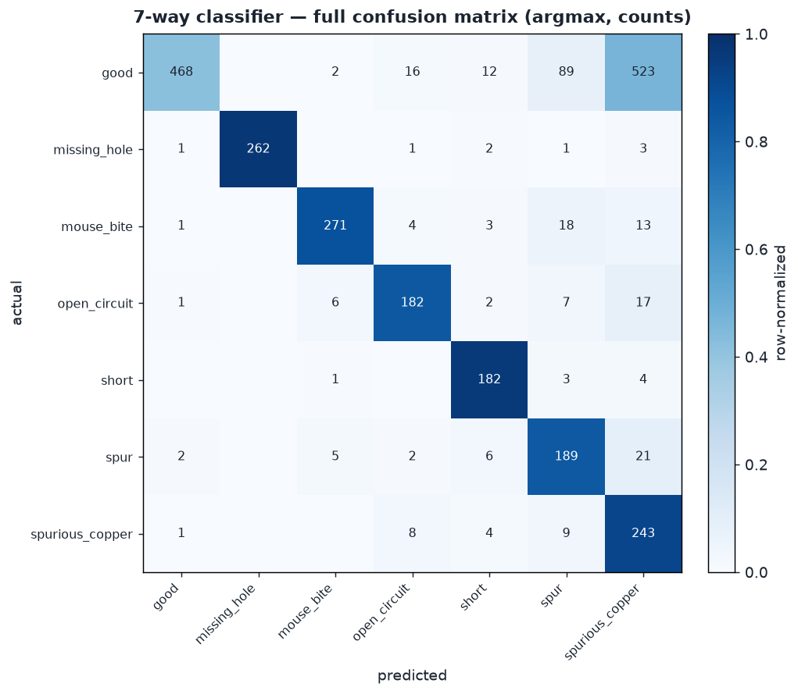

# Confusion Matrices at the Operating Threshold

Full confusion matrix for every model **at the recommended operating threshold** (see
[`MODEL_REPORT.md` §4](MODEL_REPORT.md#4-operating-threshold--recall-leaning-but-accuracy-still-high)).
The binary thresholds are set **recall-leaning** — pushed a bit below the F2-optimum to catch more
defects while keeping accuracy high. For the 7-way classifier both **0.5** and **optimal** are
shown, as asked. Rows = actual, columns = predicted.

| model | operating threshold | recall / accuracy | how chosen |
|---|---|---|---|
| ResNet 256-offset | **0.40** | 0.949 / 0.875 | recall-leaning |
| ResNet 512-offset (deployment) | **0.37** | **0.989 / 0.963** | recall-leaning |
| YOLO detector (board-level) | **score 0.05** | **0.928 / 0.930** | balanced knee |
| 7-way good/bad gate | **argmax** (P(good)≥0) | 0.996 / 0.749 | optimal for the gate |

*YOLO measured on an augmented good set (1,280 clean presentations) — see §2.

Test sets: binary ResNet = 2,294 patches (1,110 good / 1,184 defective); 7-way = 2,585 patches
(1,110 good / 1,475 defective); YOLO = 1,286 defective test boards + 1,280 augmented clean-board
presentations (10 healed plates × 128 realistic-imaging draws — see §2).

---

## 1. Binary good/bad — offset-trained (defects placed anywhere)

### 256-offset @ threshold 0.40  (recall-leaning)

|                | pred good | pred bad |
|----------------|-----------|----------|
| **actual good** | 884 (TN) | 226 (FP) |
| **actual bad**  | 61 (FN)  | 1123 (TP) |

recall **0.949** · accuracy **0.875** · precision 0.833 · false-alarm 20.4%

### 512-offset @ threshold 0.37  — ✅ **CHOSEN DEPLOYMENT MODEL** (independently re-verified)

|                | pred good | pred bad |
|----------------|-----------|----------|
| **actual good** | 1038 (TN) | 72 (FP) |
| **actual bad**  | 13 (FN)   | 1171 (TP) |

recall **0.989** · accuracy **0.963** · precision 0.942 · F1 0.965 · ROC-AUC 0.996 · false-alarm 6.5%

**Confirmed by a re-run through the repo's own `eval_resnet.py`** — a different code path from the
scorer that produced these numbers — and the matrix reproduced **exactly, cell for cell**
(`details/eval_512_offset_thr037_CONFIRMED.txt`). Of 1,184 defective patches it misses **13**
(1.1%); of 1,110 clean patches it false-alarms on 72 (6.5%).

**These are pushed below the F2-optimum (0.48/0.49) to lift recall** — the asymmetry is the whole
story. At 512 the boost is nearly free: recall 0.986→**0.989** (17→13 misses) costs only 1.5 points
of accuracy (0.978→0.963), because the model is well-separated. At 256 the same push (0.938→**0.949**,
74→61 misses) costs 3.2 points (0.907→0.875) and drives false alarms to 20% — 256's low resolution
makes recall expensive. So **512 misses just 13 of 1,184 defects at 96% accuracy, while 256 misses
61 at 87%** — the clearest argument for 512 in deployment.

---

## 2. YOLO detector — board-level good/bad (augmented good set)

A board is **BAD** if the detector fires ≥1 detection above the score threshold. The in-domain good
set is only 10 clean plates — far too few to estimate a false-alarm rate (0/10 only bounds it below
~30%). So, exactly like the ResNet good set is large, the 10 plates are turned into **1,280
realistic-imaging presentations** (random sensor noise, exposure drift, focus softness,
registration shift, fixture rotation); the 1,286 defective boards get one augmented draw each, so
**both sides are scored under matched realistic imaging**. Now the confusion has a good count on par
with the defective count (`yolov3/confusion_augmented.py`).

### @ score 0.05 (operating point) — 1,286 defective vs 1,280 augmented clean

|                | pred good | pred bad |
|----------------|-----------|----------|
| **actual good** | 1193 (TN) | 87 (FP) |
| **actual bad**  | 92 (FN)   | 1194 (TP) |

recall **0.928** · false-alarm **6.8%** · accuracy **0.930** · precision 0.932

### Score sweep (same augmented sets)

| score | recall | false-alarm | accuracy | precision |
|---|---|---|---|---|
| **0.05** (operating) | **0.928** | 6.8% | **0.930** | 0.932 |
| 0.10 | 0.886 | 3.9% | 0.923 | 0.958 |
| 0.25 | 0.781 | 1.6% | 0.882 | 0.981 |

Now the false-alarm rate is **measurable**: **6.8% at the 0.05 operating point** (not "0/10"),
falling to 3.9% at 0.10 and 1.6% at 0.25 — and 0.10's 3.9% matches the independent clean-board
stress test's realistic-frame 3.7%, a good cross-check. Recall runs a touch higher than the pristine
0.900 because the injected noise also produces extra detections on truly-defective boards (which
still correctly flag them bad). This confusion is the honest deployment picture: **~93% of defective
boards caught at a ~7% clean-board false-alarm rate**, on a rig with σ2–6 read noise.

### Reference — out-of-domain good = 1,501 DeepPCB templates (B&W, un-augmented)

|                | pred good | pred bad |
|----------------|-----------|----------|
| **actual good** | 1183 (TN) | 318 (FP) |
| **actual bad**  | 129 (FN)  | 1157 (TP) |

recall 0.900 · accuracy 0.840 · false-alarm 21.2% — the DeepPCB false alarms are a domain-shift
artifact (B&W boards from a different pipeline), so the augmented in-domain set above is the
representative number.

---

## 3. 7-way classifier — {good + 6 defect types}

### Full 7×7 confusion (argmax, counts)

Per-class recall (diagonal ÷ row): `missing_hole` 0.970, `short` 0.958, `spurious_copper` 0.917,
`mouse_bite` 0.874, `open_circuit` 0.847, `spur` 0.840 — the defect types are named well. The
**`good` row is the problem**: only 468 of 1,110 clean patches are called good; **523 read as
`spurious_copper` and 89 as `spur`** (612 of the 642 good errors). Clean copper traces mimic small
copper defects — the same confusion that craters the gate below.

### Good/bad gate — collapse the 7 classes (good vs. not-good)

**@ P(good) ≥ 0.5**

|                | pred good | pred bad |
|----------------|-----------|----------|
| **actual good** | 395 (TN) | 715 (FP) |
| **actual bad**  | 5 (FN)   | 1470 (TP) |

recall **0.997** · accuracy 0.722 · false-alarm **64.4%**

**@ optimal = argmax** (P(good) ≥ 0)

|                | pred good | pred bad |
|----------------|-----------|----------|
| **actual good** | 468 (TN) | 642 (FP) |
| **actual bad**  | 6 (FN)   | 1469 (TP) |

recall **0.996** · accuracy **0.749** · false-alarm 57.8%

Both operating points confirm the 7-way head **cannot serve as the good/bad gate**: even the
better (argmax) point false-flags **58%** of clean boards. Its recall is superb (0.996–0.997, only
5–6 defects missed of 1,475), but the accuracy is wrecked by the good→copper-defect confusion.
Lowering the bar to 0.5 buys one fewer miss for +6.6 points of false alarms — a bad trade. **Keep
this head for Stage-2 defect *naming* and use the binary 512 model (§1) as the gate.**

---

## 4. Off-center vs. recall (optimal threshold)

Covered in detail in [`POSITION_STRATIFIED_REPORT.md`](POSITION_STRATIFIED_REPORT.md), re-run at
these recall-leaning thresholds. Summary: recall is **flat across the whole offset range** — at
thr 0.37 **512 holds 0.96–1.00 at every offset**; at thr 0.40 **256 sits ~0.84–0.91**, flat but
~0.10 lower. Position was decoupled by the offset training; the 256↔512 gap is resolution, not
placement.

---

## Artifacts

- `resnet/details/confusion_optimal.json` — every matrix here (7×7 + binary + gate).
- `resnet/details/balanced_threshold.json` — the F2 threshold sweep that set the operating points.
- figures: `confusion_optimal_panels.png`, `confusion_7x7.png`.
- YOLO board matrices: `yolov3/details/eval_board_indomain.txt`, `eval_board_deeppcb.txt`,
  `board_lowscore_sweep.txt`.
- Reproduce: `resnet/eval_resnet.py` / `eval_multiclass.py` (ResNet), `yolov3/board_level_eval.py`
  (YOLO), at the thresholds above.
