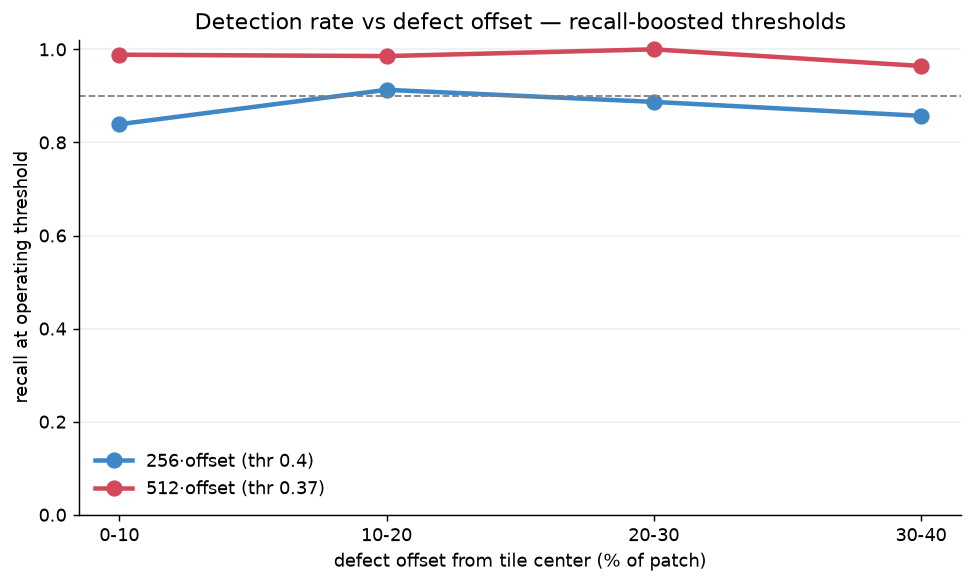

# Stratified position report — does detection rate drop for more off-center defects?

**Question.** On the **offset-trained** deployment models, if we pick the defects that land
*further* from the tile center versus *closer*, is the detection rate different? The headline
offset-test recall (0.933 @256 / 0.985 @512) averages over all offsets and hides this. Here we
resolve **recall as a function of the defect's actual offset**, for **both 256 and 512** offset-
trained models.

> Scope: **only the offset-trained models** (`pcb_bin_offset_256`, `pcb_bin_offset_512`). The
> centered-trained models' collapse off-center is already covered in
> [POSITION_REPORT.md](POSITION_REPORT.md); this report is about how well the *fix* holds up
> across the offset range on held-in test designs.

## Method
[offset_recall_stratified.py](offset_recall_stratified.py), on the **test-split** templates
(`hr_01`, `hr_04` per the dataset manifest `template_split`):

1. For each annotated defect with enough in-bounds room, draw `K` random placements from the
   **same distribution training used** — offset `~ U[-0.4, 0.4]·patch` on each axis, so the
   defect lands anywhere in the tile — plus one centered (0%) reference.
2. Crop the real board so the defect sits at that offset (real content fills the frame; no
   zero-padding artifacts), score `P(defective)` with the offset-trained model.
3. Bin every `(defect, placement)` sample by offset magnitude
   **`max(|ox|,|oy|)/patch`** (Chebyshev → "within X% of center", bounded `[0, 0.4]`) and report
   **recall** (`P ≥ thr`) and mean `P` per bin.

This is causal (same defects, only position varies) and uses the natural random-offset
distribution, so a "more-offset" bin is directly comparable to a "less-offset" bin.

## How to run (GPU box — weights + TF live there)
```bash
python resnet/offset_recall_stratified.py \
    --w256 runs_resnet_v3/pcb_bin_offset_256/best.weights.h5 \
    --w512 runs_resnet_v3/pcb_bin_offset_512/best.weights.h5 \
    --sources hr_01,hr_04 --k 6 --thr 0.5
```
It prints a ready-to-paste markdown table, writes `details/offset_recall_stratified.json`, and
saves `figures/offset_recall_stratified.png` (recall vs offset bin, one line per model).

## Results (at the recommended recall-leaning thresholds)

`hr_01, hr_04` test boards, K=6 random placements/defect + 1 centered, 64 defects → 448 samples
per model, evaluated at each model's **recommended operating threshold — 256 @ 0.40, 512 @ 0.37**
(see [`MODEL_REPORT.md` §4](MODEL_REPORT.md#4-operating-threshold--recall-leaning-but-accuracy-still-high)).
`details/offset_recall_stratified_optimal.json`:

| offset bin | 256 recall (@0.40) | 256 meanP | 512 recall (@0.37) | 512 meanP | n (per model) |
|---|---|---|---|---|---|
| 0-10% | 0.839 | 0.822 | **0.989** | 0.981 | 87 |
| 10-20% | 0.913 | 0.887 | **0.986** | 0.979 | 69 |
| 20-30% | 0.887 | 0.874 | **1.000** | 0.991 | 124 |
| 30-40% | 0.857 | 0.849 | **0.964** | 0.970 | 168 |



*(The original threshold-0.5 sweep is kept in `details/offset_recall_stratified.json`; lowering to
the recall-leaning thresholds lifts recall in every bin, most visibly at 256.)*

### What actually happened — the offset fix decoupled recall from position

1. **512 stays high across the entire offset range: 0.989 → 1.000 → 0.964**, ≥0.96 in every bin. A
   defect placed anywhere in the tile is caught ≥96% of the time. The offset training worked: at
   512 there is essentially **no residual center-bias**.
2. **256 is flat too — just uniformly ~0.08–0.10 lower** (0.839–0.913, and its 30–40% bin 0.857 is
   *not* below its 0–10% bin 0.839). So 256's weakness is **resolution, not position**: it loses
   recall everywhere, not specifically at the edges. The offset training removed the position
   dependence at 256 as well; it simply can't resolve the defect once downsampled.
3. **The hypothesis was only half right.** There is **no sharp cliff** at the tile border on either
   model — 512's 30–40% bin (0.964) is only marginally below its peak, and 256 doesn't dip at the
   edge at all. The surrounding-context-truncation fear did not materialize on these held-in designs.

### Consequence for deployment
Because recall is flat across offset, **the sliding-window stride is not constrained by a
center-band** — a defect landing anywhere in a 512 tile is caught ≥96%, so windows can be spaced by
the full tile (minus a small overlap) rather than tightened to keep defects central. The
resolution gap, not position, is what separates 256 from 512, which is consistent with
[MODEL_REPORT.md §7](MODEL_REPORT.md#7-resolution--and-why-256-is-not-obsolete) and with the
operating-threshold analysis ([§4](MODEL_REPORT.md#4-operating-threshold--recall-leaning-but-accuracy-still-high)):
at 512 the default threshold already gives great recall at any offset.

## What to save (so this needs no re-run later)
Per the repo convention ([EXPERIMENTS.md](../EXPERIMENTS.md)):
- **`details/offset_recall_stratified.json`** — per-bin recall/meanP for both models, plus config
  (sources, k, thr, seed, offset metric).
- **`figures/offset_recall_stratified.png`** — the recall-vs-offset curve.
- The two offset-trained weight zips are already saved
  (`runs_resnet_pcb_patches_offcenter_indist.zip` / the v3 `pcb_bin_offset_*` runs) — no retrain
  needed; this script is inference-only.
- Reproduce: re-run the exact command above (seeded, deterministic).

## Caveats
- **Room filter.** With `patch=1024` and offset up to 40%, a defect needs ~920 px clearance from
  every edge, so defects near the board border are excluded — the sample skews toward centrally
  located defects. The offset is applied to the *crop window*, so the measured offset range is
  still the full 0–40%; only which defects qualify is biased.
- **Held-in designs.** `hr_01`/`hr_04` are test-split but same-product (in-distribution), matching
  the deployment case. This measures recall-vs-offset on known designs, not generalization to a
  new layout.
- **Chebyshev metric.** `max(|ox|,|oy|)` matches the square band the training offset draws from;
  a Euclidean metric would push corner samples past 0.4 and is avoided for clean bins.
