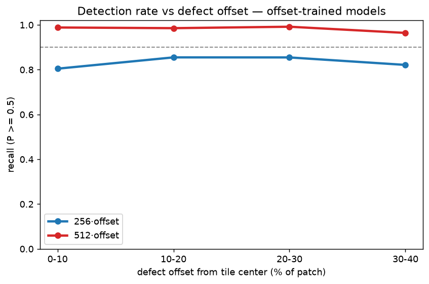

# Stratified position report — does detection rate drop for more off-center defects?

**Question.** On the **offset-trained** deployment models, if we pick the defects that land
*further* from the tile center versus *closer*, is the detection rate different? The headline
offset-test recall (0.933 @256 / 0.985 @512) averages over all offsets and hides this. Here we
resolve **recall as a function of the defect's actual offset**, for **both 256 and 512** offset-
trained models.

> Scope: **only the offset-trained models** (`pcb_bin_offset_256`, `pcb_bin_offset_512`). The
> centered-trained models' collapse off-center is already covered in
> [POSITION_REPORT.md](POSITION_REPORT.md); this report is about how well the *fix* holds up
> across the offset range on held-in test designs.

## Method
[offset_recall_stratified.py](offset_recall_stratified.py), on the **test-split** templates
(`hr_01`, `hr_04` per the dataset manifest `template_split`):

1. For each annotated defect with enough in-bounds room, draw `K` random placements from the
   **same distribution training used** — offset `~ U[-0.4, 0.4]·patch` on each axis, so the
   defect lands anywhere in the tile — plus one centered (0%) reference.
2. Crop the real board so the defect sits at that offset (real content fills the frame; no
   zero-padding artifacts), score `P(defective)` with the offset-trained model.
3. Bin every `(defect, placement)` sample by offset magnitude
   **`max(|ox|,|oy|)/patch`** (Chebyshev → "within X% of center", bounded `[0, 0.4]`) and report
   **recall** (`P ≥ thr`) and mean `P` per bin.

This is causal (same defects, only position varies) and uses the natural random-offset
distribution, so a "more-offset" bin is directly comparable to a "less-offset" bin.

## How to run (GPU box — weights + TF live there)
```bash
python resnet/offset_recall_stratified.py \
    --w256 runs_resnet_v3/pcb_bin_offset_256/best.weights.h5 \
    --w512 runs_resnet_v3/pcb_bin_offset_512/best.weights.h5 \
    --sources hr_01,hr_04 --k 6 --thr 0.5
```
It prints a ready-to-paste markdown table, writes `details/offset_recall_stratified.json`, and
saves `figures/offset_recall_stratified.png` (recall vs offset bin, one line per model).

## Results — TO FILL IN after the GPU run
Paste the script's markdown table here:

| offset bin | 256 recall | 256 meanP | 512 recall | 512 meanP | n (per model) |
|---|---|---|---|---|---|
| 0-10% | _ | _ | _ | _ | _ |
| 10-20% | _ | _ | _ | _ | _ |
| 20-30% | _ | _ | _ | _ | _ |
| 30-40% | _ | _ | _ | _ | _ |



### Expected shape (hypothesis, from the controlled N=10 sweep)
- Both models should stay high (recall ≳ 0.95) through ~20–30% and dip at 30–40%, where the
  defect is against the tile border and its surrounding context is truncated.
- **512 should hold up better than 256** across the range — it retains the fine detail needed to
  localize a defect wherever it lands (mirrors the aggregate 0.985 vs 0.933).
- If **256's 30–40% bin drops materially below its 0–10% bin**, that quantifies the residual
  center-bias the offset training didn't fully remove → set the sliding-window stride so defects
  land within the still-strong band.

## What to save (so this needs no re-run later)
Per the repo convention ([EXPERIMENTS.md](../EXPERIMENTS.md)):
- **`details/offset_recall_stratified.json`** — per-bin recall/meanP for both models, plus config
  (sources, k, thr, seed, offset metric).
- **`figures/offset_recall_stratified.png`** — the recall-vs-offset curve.
- The two offset-trained weight zips are already saved
  (`runs_resnet_pcb_patches_offcenter_indist.zip` / the v3 `pcb_bin_offset_*` runs) — no retrain
  needed; this script is inference-only.
- Reproduce: re-run the exact command above (seeded, deterministic).

## Caveats
- **Room filter.** With `patch=1024` and offset up to 40%, a defect needs ~920 px clearance from
  every edge, so defects near the board border are excluded — the sample skews toward centrally
  located defects. The offset is applied to the *crop window*, so the measured offset range is
  still the full 0–40%; only which defects qualify is biased.
- **Held-in designs.** `hr_01`/`hr_04` are test-split but same-product (in-distribution), matching
  the deployment case. This measures recall-vs-offset on known designs, not generalization to a
  new layout.
- **Chebyshev metric.** `max(|ox|,|oy|)` matches the square band the training offset draws from;
  a Euclidean metric would push corner samples past 0.4 and is avoided for clean bins.
