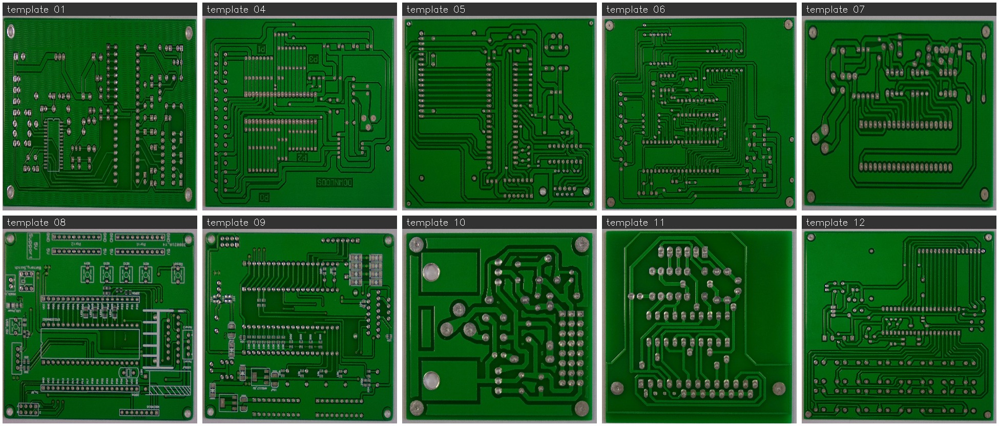
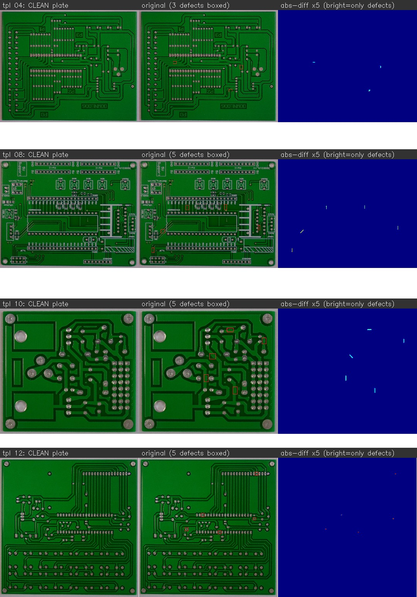
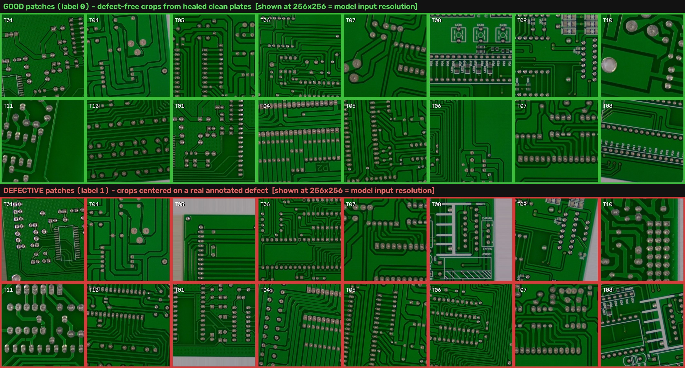

# ResNet-50 PCB Classifier (good board vs. defective board)

A board-level **binary classifier** — the counterpart to the YOLOv3 detector in
[`../yolov3/`](../yolov3/). Instead of localizing every defect, it answers one
question per board:

> **Is this board good, or defective?**  →  `P(defective) ∈ [0, 1]`

Label convention: **good = 0, defective = 1** (positive class = defective, because the
costly mistake is *shipping a bad board*, so recall on the positive class is the
headline safety metric).

Targets the same hardware as the detector — **Intel FPGA AI Suite, Agilex 7 F-series
SoC**. ResNet-50 is a *reference* model for the AI Suite DLA (plain conv / BN / ReLU /
add / global-avg-pool / dense), so the whole graph maps to the FPGA with no custom ops
— simpler to deploy than YOLO's decode/NMS.

## Layout

```
resnet/
  resnet50_tf.py              ResNet-50 model (ImageNet backbone + binary head)
  data.py                     tf.data pipeline (grayscale→3ch, augment, class weights)
  mine_patches.py             ⭐ tile boards -> in-domain good/bad PATCH dataset
  build_classifier_dataset.py assemble datasets/pcb_goodbad/ {train,val,test}/{good,bad}
  train_resnet.py             two-phase transfer learning (freeze → unfreeze)
  eval_resnet.py              confusion matrix, precision/recall, ROC-AUC, PR-AUC, sweep
  export_openvino.py          SavedModel → OpenVINO IR for the FPGA
  extra_good/                 (gitignored) drop downloaded "good board" images here
  README.md
```

## Quick start — recommended: the PATCH route ⭐

Patch-level classification (zoomed-in tiles) is the way to go here: good and bad tiles
are mined from the *same boards at the same zoom*, so there's no domain leak, tiny
defects fill more of the frame, and clean tiles are abundant (so good ≫ bad). A board's
verdict is then "bad if **any** tile is bad".

Recommended is **`--heal` mode** on the **HRIPCB** source. HRIPCB's defects are
photoshopped onto 10 base templates, each with many pixel-aligned copies; the per-pixel
**median** across a template's copies reconstructs a fully **clean plate** (verified:
diff vs original is zero except at defect spots). Then:
  * **good** = random 1024px crops translated across the whole clean plate (guaranteed
    defect-free — the entire board is usable), lightly shift/rotation-augmented;
  * **bad** = 1024px crops around each real defect on the original images;
  * split is **by template**, so val/test are held-out board layouts (no leakage).

```bash
# 1. Mine the healed COLOR good/bad PATCH dataset (HRIPCB, 1024px).
python resnet/mine_patches.py --heal                  # clean plates -> good, defects -> bad
python resnet/mine_patches.py --heal --build-plates-only   # just build/inspect plates

# (non-heal alternative: slide over defective boards, dodging defect boxes)
python resnet/mine_patches.py --source all --patch 512 --stride 256

# 2. Phase 1 — train the head, backbone frozen (patch size 256)
python resnet/train_resnet.py --data datasets/pcb_patches --size 256 --epochs 20 --batch 32

# 3. Phase 2 — unfreeze, low LR, fine-tune to the PCB domain
python resnet/train_resnet.py --data datasets/pcb_patches --size 256 \
       --resume runs_resnet/pcb_patches/best.weights.h5 --unfreeze --lr 1e-5 --epochs 15

# 4. Evaluate (precision/recall/PR-AUC + threshold sweep)
python resnet/eval_resnet.py --weights runs_resnet/pcb_patches/best.weights.h5 \
       --data datasets/pcb_patches --size 256 --threshold 0.5

# 5. Export OpenVINO IR for the FPGA AI Suite
python resnet/export_openvino.py --weights runs_resnet/pcb_patches/best.weights.h5 \
       --size 256 --out release_resnet
```

Skew the good:bad ratio with `--good-per-board` / `--bad-jitter` (and the global
`--max-good` / `--max-bad` caps); control zoom with `--patch` / `--stride`; control
augmentation with `--aug` / `--shift-px` / `--rot-deg`. Patches are cropped at `--patch`
(zoom) but **stored downscaled** to `--save-size` (default 384, JPG) so the dataset stays
small — we train at 256 anyway.

### The 10 reconstructed clean plates + verification

The median reconstruction is exact — the clean plate differs from each original only at
that copy's defects (bright specks below), nowhere else, so no artifacts and no
smoothness cheat.




### Dataset splits & measured performance

The trained dataset (`datasets/pcb_patches`, 384px JPG patches) splits ~8/1/1 at the
**patch level** — all 10 templates appear in every split:

| split | good | bad | total |
|-------|------|-----|-------|
| train | 9,600 | 9,448 | 19,048 |
| val   | 1,200 | 1,180 | 2,380 |
| test  | 1,200 | 1,184 | 2,384 |
| **total** | **12,000** | **11,812** | **23,812** |

What the training patches actually look like (good = defect-free crops from the healed
clean plates; bad = crops centered on a real annotated defect), spread across templates
T01–T12, shown at **256×256 — the exact resolution the model sees** (each is the 384px
stored patch resized to the 256px network input):



Because every board layout is present in train **and** test, this is an *in-distribution*
test — it measures performance on **boards the model has seen**, which matches the
deployment plan (in production you train on the same boards you inspect). Test result
(`best.weights.h5`, size 256, threshold 0.5):

```
               pred good   pred bad
  actual good     1159         41
  actual bad         4       1180
accuracy 0.981 · precision 0.966 · recall 0.997 · ROC-AUC 0.999 · PR-AUC 1.000
```

Failure mode is over-cautious — 41 false alarms vs. only 4 missed defects, the safe
direction for a screen.

**A note on leakage (minor, accepted).** Each defect is minted as 4 jittered siblings
(±12 px, ±12°); the per-patch split scatters them across train/test, so ~14 % of
test-**bad** patches have a near-identical twin the model trained on (the **good** patches
are clean — distinct random crops of the healed plate, ~0 % near-dups). This slightly
inflates bad-class recall/PR-AUC. The good-side precision and false alarms are
unaffected. Net honest range is ~0.97–0.98 (cf. an earlier by-template held-out split
that scored 0.972). A little leakage is acceptable here since the deployment target is
the same-boards regime anyway; for a leakage-free number, split per-defect (keep a
defect's 4 siblings in one split) instead of per-patch.

### Regenerating the dataset from the source boards (e.g. at 512 px)

Patches are *derived* data; the ground truth is the **HRIPCB source boards + labels**
(`datasets/unified_pku_yolo/**/hr_*`, ~916 MB, gitignored). To continue on another
machine and mine higher-resolution patches:

1. Get the boards. They ship separately from git (too large) — as `hripcb_source.zip`
   via Google Drive. On the new machine:
   ```bash
   pip install gdown && gdown <DRIVE_FILE_ID> -O datasets/hripcb_source.zip
   cd datasets && unzip -q hripcb_source.zip && cd ..     # recreates unified_pku_yolo/**/hr_*
   ```
2. Mine patches at 512 px (vs the old 384 — less downscale, more defect signal):
   ```bash
   python resnet/mine_patches.py --heal --save-size 512            # 1024 crop -> saved at 512
   # or tighter zoom per defect:
   python resnet/mine_patches.py --heal --patch 768 --save-size 512
   ```
   Clean plates auto-rebuild from the boards; output lands in `datasets/pcb_patches/`.
3. Train at the new size, e.g. `--size 384` or `512` (see the two-phase recipe above).

Mining only needs `opencv-python` + `numpy`. Note: this script produces a **by-template
6/2/2 held-out split** (`tpl_XX_NNNNNN` naming), which is the honest held-out evaluation —
not the per-patch in-distribution split of the previously trained `pcb_patches`.

### Alternative: whole-board route

Treat each board as one image (good = DeepPCB templates, bad = defective boards). Simpler
but tiny defects are hard at 224, good boards are scarce (templates only), and it's the
binary B&W DeepPCB domain rather than the color boards — so the patch route above is
preferred.

```bash
python resnet/build_classifier_dataset.py                 # ~1500 good + ~1500 bad
python resnet/train_resnet.py --data datasets/pcb_goodbad --epochs 20 --batch 32
# ...eval / export as above, with --data datasets/pcb_goodbad
```

Both routes use the same env as the detector (`requirements-train.txt`: TF + OpenVINO).

## Running on another machine (GPU) — dataset via Google Drive

The code lives in git; the **dataset does not** (it's gitignored). To train on a GPU box
(Colab / H100), move the patch dataset over once:

**On this Mac** — the mine already produced `datasets/pcb_patches.zip` (~1.1 GB). Upload it
to Google Drive (drag it into drive.google.com, or `rclone copy datasets/pcb_patches.zip
gdrive:`).

**On the GPU machine:**
```bash
git clone https://github.com/EasonLi292/PCB_yolov3.git && cd PCB_yolov3
pip install -r requirements-train.txt
# fetch the dataset from Drive (share-link id) and unzip into datasets/
pip install gdown && gdown <DRIVE_FILE_ID> -O datasets/pcb_patches.zip
cd datasets && unzip -q pcb_patches.zip && cd ..
# phase 1 (frozen head) then phase 2 (unfreeze all) -- same recipe as the detector
python resnet/train_resnet.py --data datasets/pcb_patches --size 256 --epochs 12 --batch 64
python resnet/train_resnet.py --data datasets/pcb_patches --size 256 --batch 64 \
       --resume runs_resnet/pcb_patches/best.weights.h5 --unfreeze --lr 1e-5 --epochs 15
python resnet/eval_resnet.py --weights runs_resnet/pcb_patches/best.weights.h5 \
       --data datasets/pcb_patches --size 256
python resnet/export_openvino.py --weights runs_resnet/pcb_patches/best.weights.h5 \
       --size 256 --out release_resnet
```
ImageNet weights auto-download on first build. You don't need `clean_plates/` or the raw
data on the GPU box unless you want to re-mine there (then also copy those and run
`mine_patches.py --heal`).

## Getting "good" (defect-free) board images — the scarce class

You want **many more good boards than bad**. Bad boards are easy (every PCB-defect
dataset is full of them); defect-free boards are the bottleneck.

### ⚠️ Domain-match first, count second

The good and bad images **must come from the same imaging domain** (same board style,
lighting, resolution). If "good" comes from a different-looking dataset than "bad", the
ResNet just learns *which dataset the image is from* — not whether it has a defect — and
scores great in validation while being useless in production. This is why scraping
pretty-but-mismatched good-board photos (e.g. PCB-AoI's grainy AOI scans, generic
bare-board galleries) **hurts** rather than helps. Prefer the in-domain options below.

Sources, best first:

| # | Source | What you get | How to use |
|---|--------|--------------|-----------|
| 1 | **DeepPCB templates** (already local) | ~1,500 registered **defect-free** reference images (`*_temp.jpg`), paired 1:1 with the defective `*_test.jpg` — *identical* domain to our bad boards. | Wired in automatically by `build_classifier_dataset.py`. |
| 2 | **Defect-free patch mining** ⭐ (in-domain, free) | A defective board is ~99% defect-free *area*. Tile every board; any tile that doesn't overlap a defect box is a legitimate **good** patch — same domain & zoom as the bad patches. ~60k good / 40k bad in **color** from the PKU boards. | `python resnet/mine_patches.py` (uses the PKU YOLO defect boxes). See the **patch route** above. |
| 3 | **Augment the good templates** | Each good board under different flips/rotations/lighting is *still good*. Multiplies the 1,500 templates without leaving the domain. | Already applied at train time (`data.py` augment); can also pre-bake more. |
| 4 | **VisA — pcb1–pcb4** — [amazon-science/spot-diff](https://github.com/amazon-science/spot-diff) / [HuggingFace `BrachioLab/visa`](https://huggingface.co/datasets/BrachioLab/visa) | High-quality, purpose-built for good-vs-anomaly: **~4,000 normal + ~400 anomalous** real PCB photos. Ships **both** classes in one domain. | Train a *separate* model on VisA (its good **and** bad together), or as a clean second domain — don't mix its good with DeepPCB bad. |
| 5 | **Your own captures** ⭐ | Photos of known-good boards from *your* line/camera. | The single best domain match — a handful of real good boards from the deployment camera beats thousands of mismatched ones. Drop in `extra_good/`. |

(Aggregator worth a look: [PCB-Bank](https://github.com/SSRheart/PCB-Bank) collects many PCB
anomaly datasets in one place.)

**`extra_good/` is the single hook.** Anything you put under `resnet/extra_good/**`
(any nesting) is scanned recursively, labeled **good**, group-split, and merged in on the
next `build_classifier_dataset.py` run. It's gitignored, so large downloads stay out of
the repo. The builder prints a warning whenever good < bad, so you know to add more.

## How the pieces handle the realities

- **Class imbalance** (good ≫ bad, or the reverse): inverse-frequency **class weights**
  (`data.class_weights`) so the rarer class isn't ignored; eval reports **PR-AUC** and a
  **threshold sweep** rather than just accuracy (which is misleading under imbalance).
- **Color**: most boards are color photos and color is the native input for the ImageNet
  backbone, so the classifier runs in RGB (the detector stays grayscale). The FPGA IR
  input is `[1,size,size,3]` either way, so color costs nothing at deploy time.
- **Transfer learning**: phase 1 freezes the ImageNet backbone (head only), phase 2
  unfreezes it at a low LR to adapt to the grayscale-PCB domain.

## Caveat: tiny defects vs. whole-board resizing

A whole board resized to 224×224 can lose a sub-millimetre defect. Two ways to fix it
when accuracy on subtle defects matters:

1. **Larger input** — `--size 320` / `448` (ResNet's global-avg-pool accepts any square
   size; the AI Suite supports configurable input). Higher cost, more defect signal.
2. **Patch-based** — slice each board into tiles, classify each, call the board bad if
   *any* tile is bad. DeepPCB's 640×640 crops are already patch-sized, which is why they
   work well here. This is the usual production approach.

The current scaffold is the straightforward whole-image classifier; both options above
are drop-in extensions of `data.py` / `--size`.
