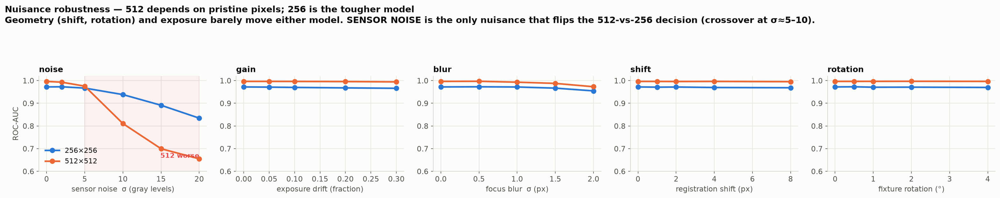

# Resolution report — 512×512 vs 256×256

**TL;DR.** With **equal training budget**, 512 beats 256 by a **modest, real margin**:
+0.033 accuracy on centered defects, +0.048 on realistic off-center defects (best-threshold).
Off-center placement costs 256 about **0.027** accuracy and 512 about **0.012** — not the
catastrophic collapse an earlier, under-trained 256 run suggested. ResNet-50's global average
pooling makes it largely translation-invariant, and the measurements agree.

> **Correction.** An earlier version of this report claimed 256 fell to 0.820 under offset and
> that the 512-vs-256 gap widened from +0.06 to +0.17. Both were artifacts:
> (1) the 256 models were **under-trained** (batch 32, short schedule) — retraining at the same
> budget as 512 moved 256-offset from 0.820 → 0.912; and (2) accuracy was read at the default
> 0.5 threshold, where the offset-trained models are **mis-calibrated** toward "bad". See
> [details/](details/) and the *Diagnostics* section below.

## Setup
Both models trained on the same data, only `--size` differs; **identical budget** (30 frozen +
25 unfrozen epochs, lr 1e-3 → 1e-5; batch 64 @256 / 16 @512, the largest that fits). Split is
the per-(photo, defect) unit holdout (in-distribution — same board designs and photos in train
and test; the strict-imaging production regime). Two datasets differ only in defect placement:
**centered** vs **offset 0.4** (defect anywhere in the tile).

Test = 2294 patches (1110 good, 1184 bad); the good set is identical in both.

## The 2×2 — resolution × placement

| | acc @0.5 | acc @best thr | precision | recall | ROC-AUC |
|---|---|---|---|---|---|
| 256 · centered | 0.957 | **0.963** (thr 0.7) | 0.950 | 0.969 | 0.995 |
| 256 · offset 0.4 | 0.912 | **0.936** (thr 0.7) | 0.899 | 0.933 | 0.971 |
| 512 · centered | 0.994 | **0.996** (thr 0.6) | 0.994 | 0.995 | 1.000 |
| 512 · offset 0.4 | 0.979 | **0.984** (thr 0.8) | 0.974 | 0.985 | 0.996 |

**Cost of realistic placement:** 256 −0.027, 512 −0.012 (best-threshold).
**512-vs-256 gap:** +0.033 centered, +0.048 offset.

## Diagnostics — three things that were *not* the cause

1. **Not aliasing.** `data.py` uses `tf.image.resize(..., antialias=False)`, which sounds like a
   bug for a 512→256 downsample. Measured: at an *exact* 2× ratio TF's bilinear is **identical**
   to `cv2.INTER_AREA` (`mean|diff| = 0.000`). `antialias=True` is a *different, blurrier*
   filter. No bug; no change made.
2. **Not a harder test set.** Last Friday's release 256 model scores 0.990 / AUC 1.000 on this
   same test set — but that is **memorization, not skill**: both datasets were mined with
   `SEED=42`, so the random crop centers coincide. dHash: **28% exact matches, median nearest
   distance 1 bit** between our test patches and the release model's training pool (vs 10–12
   bits *within* our own split, confirming dHash discriminates fine). The release model trained
   on our test crops. It is not a valid reference.
3. **Not position sensitivity per se.** See the nuisance sweep: an 8 px registration shift costs
   0.009 accuracy and a 4° rotation 0.019. The model *is* nearly translation-invariant. What the
   "offset" dataset changes is the *tile content and defect-to-edge distance*, not merely
   position — and it shifts the model's calibration.

**What was real:** the 256 runs were under-trained. Equal budget recovered most of the gap.

| | v2 (batch 32, 20+15) | v3 (batch 64, 30+25) |
|---|---|---|
| 256 centered | 0.935 | **0.957** |
| 256 offset | 0.820 | **0.912** |
| 512 centered | 0.994 | 0.994 |
| 512 offset | 0.989 | 0.979 |

## Why 512 still wins (a little)
These defects are ~80 px on a ~3000 px board. Inside a 1024 px tile they are ~20 px at 256 and
~40 px at 512. ResNet-50 downsamples by 32, so the final feature map is 8×8 at 256 vs 16×16 at
512 — a 20 px defect occupies well under one cell at 256. Small-object detection is genuinely
resolution-hungry; that, not position, is where the 512 advantage lives. It shows up as
**precision** (0.899 vs 0.974 under offset): the 256 model has less evidence and hedges.

## Critical caveat — 512's lead exists only on pristine pixels

The nuisance sweep ([DETAILED_RESULTS.md](DETAILED_RESULTS.md) §2) injects realistic sensor noise
at inference. **512 is markedly more fragile than 256, and the ordering flips:**

| sensor noise σ (gray levels) | 256 ROC-AUC | 512 ROC-AUC |
|---|---|---|
| 0 (as-shipped HRIPCB) | 0.972 | **0.996** |
| 5 | 0.967 | 0.976 |
| 10 | **0.938** | 0.811 |
| 20 | **0.835** | 0.655 |

**Crossover at σ ≈ 5–10.** Physically: 256's 2× downsample averages four pixels into one, halving
the noise; 512 keeps the fine high-frequency detail — and the noise riding on it. HRIPCB is a
single pristine photograph with defects pasted in, so it has *zero* sensor noise; 512's advantage
is measured under conditions no real camera provides.

(Focus blur also hurts 512 more, but does **not** flip the ordering. Registration shift, rotation
and exposure drift are near-free for both.)

## Recommendation
The resolution choice is **governed by your imaging noise floor**, not by the clean-data table:

- **If read noise σ < 5 gray levels** (a good machine-vision sensor, decent exposure): **use 512.**
  0.984 vs 0.936 accuracy under realistic placement, for 4× MACs.
- **If σ ≳ 10, or focus is soft: use 256.** It is *more accurate* there (AUC 0.938 vs 0.811) and
  degrades gracefully. Buying 512 would cost 4× compute for a *worse* model.
- **Measure your rig's noise before committing to 512.** That single number decides this.
- **Tune the decision threshold on a validation split.** Every model here peaks above 0.5; the
  offset-trained models need **thr ≈ 0.7**. Leaving it at 0.5 costs 0.005–0.024 accuracy and was
  the source of the original "256 collapses" error.
- 384 remains the untested middle (~2.25× 256 compute) and may be the robustness sweet spot.

## Caveats
- In-distribution split (same designs/photos in train and test), appropriate for a fixed line
  with strict imaging. HRIPCB has **one photograph per design**, so there is zero board-to-board
  nuisance variation; see the nuisance sweep for how much of these numbers survive real noise.
- Healed clean-plate GOOD vs real defective BAD is slightly easier than real-vs-real.
- Offset 0.4 = "anywhere but still fully framed." Match it to your window geometry.

## Artifacts
- weights: `runs_resnet_v3/pcb_bin_{center,offset}_{256,512}/`
- full confusion matrices + threshold sweeps: [`details/`](details/)
- Re-test: `python resnet/eval_resnet.py --weights <run>/best.weights.h5 --data datasets/pcb_bin_offset --size <256|512>`
