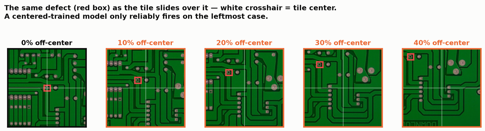
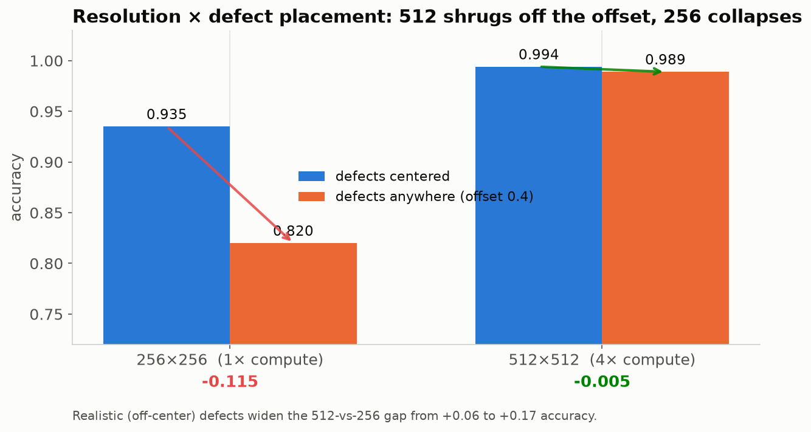

# Resolution report — 512×512 vs 256×256, at realistic defect placement

**TL;DR.** With defects placed **anywhere in the tile** (as a sliding window actually finds
them), **512 is not a luxury — it is what makes the classifier work.** 512 shrugs off the
offset (0.994 → **0.989**); 256 collapses (0.935 → **0.820**, precision 0.90 → 0.76). The
512-vs-256 gap widens from **+0.06 on centered defects to +0.17 on realistic ones.**
A centered-only comparison badly understates the case for 512.

## Setup
Both models trained on the same data, only `--size` differs. Split is the **per-(photo,
defect) unit holdout** (in-distribution — same board designs and photos in train and test,
which is the strict-imaging production regime; see *Methodology* in [RESULTS.md](RESULTS.md)).
Two datasets differing only in defect placement:

- **centered** — BAD crops centered on the defect (`--defect-offset 0`)
- **offset 0.4** — BAD crops with the defect placed uniformly anywhere up to `0.4×patch`
  from the tile center (`--defect-offset 0.4`)

Test = 2294 patches (1110 good, 1184 bad), identical good set in both.

## The 2×2 — resolution × placement

| | accuracy | precision | recall | ROC-AUC |
|---|---|---|---|---|
| 256 · centered | 0.935 | 0.903 | 0.979 | 0.992 |
| 256 · **offset 0.4** | **0.820** | **0.755** | 0.965 | 0.967 |
| 512 · centered | 0.994 | 0.990 | 0.999 | 1.000 |
| 512 · **offset 0.4** | **0.989** | **0.997** | 0.981 | 0.997 |

Effect of realistic placement: **256 loses 0.115 accuracy; 512 loses 0.005.**

## Why 256 breaks
A 1024 px tile squashed to 256 is a **4× downscale**; at 512 it is only 2×. A small defect
(these are ~80 px on a ~3000 px board) that also sits near the tile edge has very little signal
left after a 4× downscale. The failure shows up as **precision collapse (0.903 → 0.755)**, not
recall: the 256 model still fires on defects (recall 0.965) but now fires on clean patches too.
Trained on BAD tiles that are mostly-clean-with-a-defect-at-the-edge, it learns "mostly clean
can still be bad" and floods the good class with false alarms. At 512 the defect remains
resolvable wherever it lands, so the model keeps a crisp boundary (precision 0.997).

## Recommendation
- **Deploy 512×512.** Under realistic placement it delivers 0.989 accuracy / 0.997 precision;
  256 gives 0.820 / 0.755. The 4× DLA cost buys a working classifier, not a marginal gain.
- **If 256 is forced by the compute budget**, you must compensate with **heavy tile overlap**
  so every defect lands near some tile's center (a stride ≲ 0.2·tile) — trading the compute you
  saved on resolution back into more tiles, plus a higher decision threshold to claw back
  precision.
- 384 is the untested middle (≈2.25× 256 compute); worth a run if 512 doesn't fit.

## Caveats
- In-distribution split: same board designs and photos in train and test — appropriate for a
  fixed line with strict, repeatable imaging. HRIPCB has exactly **one photograph per design**,
  so there is *zero* board-to-board nuisance variation (no sensor noise, lighting drift, or
  registration jitter). Real rigs have some; expect a modest haircut on these numbers.
- Healed clean-plate GOOD vs real defective BAD is a slightly easier separation than real-vs-real.
- Offset 0.4 was chosen as "defect anywhere but still fully framed." Match it to your window
  geometry (50% tile overlap ⇒ worst-case offset ≈ 0.25).

## Artifacts
- 512 offset: `runs_resnet/pcb_bin_offset/` → `runs_resnet_pcb_bin_offset_v2.zip`
- 256 offset: `runs_resnet_at256/pcb_bin_offset/` → `runs_resnet_at256_pcb_bin_offset_v2.zip`
- 512/256 centered: `runs_resnet*/pcb_bin_center/` → `runs_resnet*_pcb_bin_center_v2.zip`
- datasets: `datasets_pcb_bin_{center,offset}_v2.zip` (+ `dataset_manifest.json`, seeded)
- Re-test: `python resnet/eval_resnet.py --weights <run>/best.weights.h5 --data datasets/pcb_bin_offset --size <256|512>`
