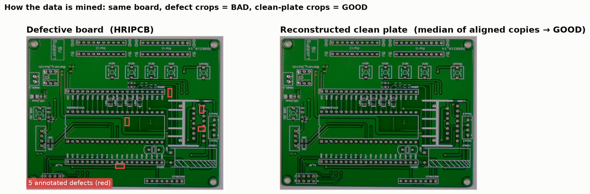
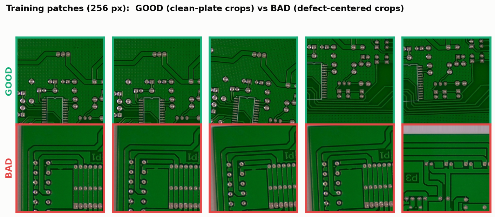
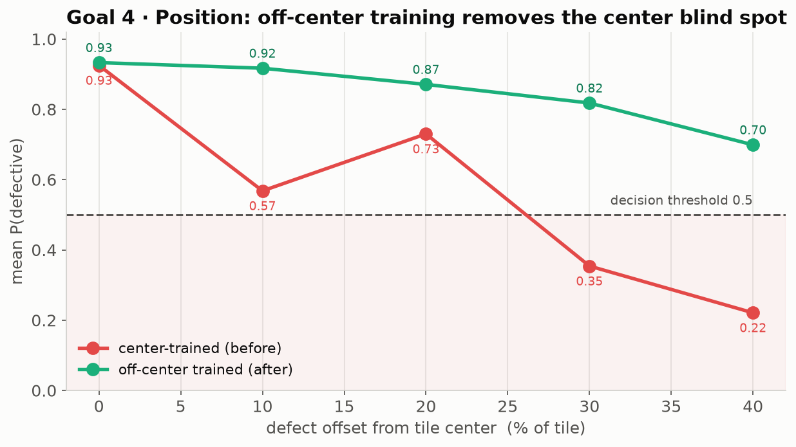
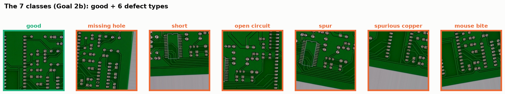
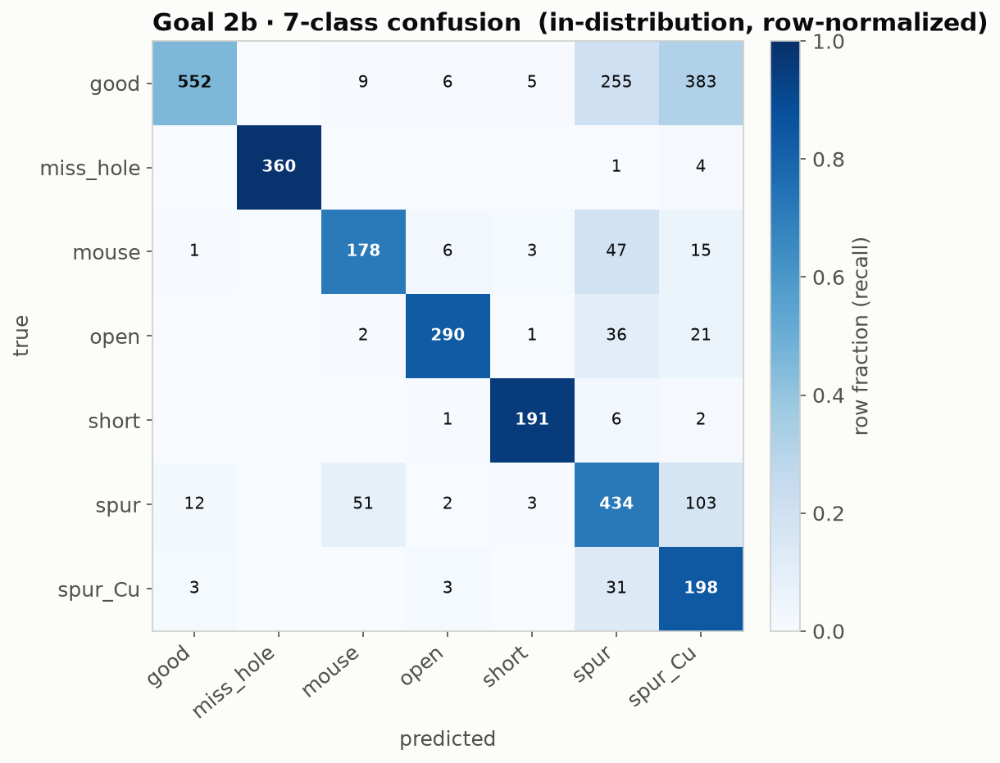
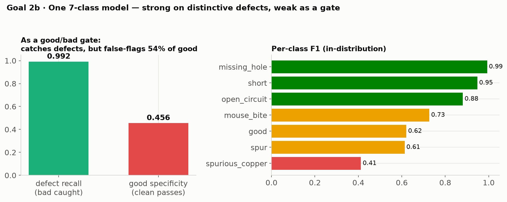

# PCB defect classifier — results

A ResNet-50 good/bad + defect-type classifier mined from the HRIPCB board set. All numbers
below are **in-distribution**: the test set contains the **same board designs** seen in
training — the realistic production-line case (you inspect a PCB product you trained on). Each
experiment was also run on a harder held-out-template split (unseen layouts); those numbers
live in the per-experiment reports.

## How the data is made

Every board is ~99% defect-free area, so we mine patches from the boards we have. **BAD** =
crops centered on an annotated defect; **GOOD** = crops of a *reconstructed clean plate* (the
per-pixel median of a template's aligned copies washes the defects out). Good and bad come from
the **same boards at the same zoom**, so the model can only cheat on the defect itself.





---

## Goal 3 · Resolution — does 512×512 beat 256×256?

**Yes, in-distribution.** At 512 the classifier is essentially saturated (0.99 everywhere); at
256 it makes ~3× as many mistakes. The extra resolution preserves fine, board-specific defect
texture the 256 downscale throws away.


| | Accuracy | Precision | Recall | ROC-AUC | Compute |
|---|---|---|---|---|---|
| 256×256 | 0.939 | 0.923 | 0.965 | 0.985 | 1× |
| **512×512** | **0.992** | **0.992** | **0.994** | **0.998** | 4× |

> On *unseen* board layouts the two tie (AUC 0.93 vs 0.93) — resolution helps only on designs
> the model has seen. **Fixed product line → 512 is worth the 4× cost; must generalize → 256.**
> Full detail: [RESOLUTION_REPORT.md](RESOLUTION_REPORT.md).

---

## Goal 4 · Position — does an off-center defect still get caught?

The centered-defect model has a **center blind spot**: confidence collapses from 0.93 at center
to 0.22 at 40% off-center. Re-training with defects placed off-center (`--defect-offset 0.3`)
**flattens the curve** — it still catches 10/10 defects at 30% off-center (vs 2/10 before), at a
modest overall-accuracy cost (0.94 → 0.82, recall stays 0.96). This validates a sliding-window
deployment with a coarser stride.



> Full detail: [POSITION_REPORT.md](POSITION_REPORT.md).

---

## Goal 2b · One 7-class model — good + defect type, defects anywhere

A single model that says **good** or names the defect (`{good, missing_hole, mouse_bite,
open_circuit, short, spur, spurious_copper}`), trained with defects placed **anywhere** in the
tile to mimic a real board.



It nails the distinctive defects — **`missing_hole` F1 0.99, `short` 0.95, `open_circuit`
0.88** — but the copper-texture trio (`spur`/`spurious_copper`/`mouse_bite`) trades among itself,
and as a **good/bad gate it is weak**: it catches 99% of defects yet false-flags **54% of good**
patches (clean copper traces look like small copper defects).





> **Conclusion: keep good/bad and defect-type as two stages.** A dedicated binary gate has ~0.9
> specificity; folding `good` into the 7-class head drops that to 0.46. Full detail:
> [MODEL_REPORT_7CLASS.md](MODEL_REPORT_7CLASS.md).

---

## Recommended deployment

```
board → sliding window (256 or 512 tiles)
      → Stage 1: binary good/bad gate   (position-augmented; 512 if fixed product line)
            good → pass
            bad  → Stage 2: defect-type namer  → report the defect
```

- **512×512** input on a fixed product line → ~0.99 good/bad accuracy.
- **Position-augmented** gate so a defect anywhere in a tile is caught.
- **Two stages**, not one 7-class model — the gate needs the specificity.

## Saved artifacts (reproducible without retraining)

Every run has a `run_manifest.json` (config + git commit + exact re-test command); every dataset
a `dataset_manifest.json` (`split_mode: defect`, seeded → regenerable). Weights + datasets are
zipped with an `_indist` suffix (held-out-template versions are in the non-`_indist` zips).

| experiment | weights | dataset |
|---|---|---|
| G3 512 / 256 | `runs_resnet_pcb_patches_512_indist.zip` · `runs_resnet_at256_pcb_patches_512_indist.zip` | `datasets_pcb_patches_512_indist.zip` |
| G4 position | `runs_resnet_pcb_patches_offcenter_indist.zip` | `datasets_pcb_patches_offcenter_indist.zip` |
| G2b 7-class | `runs_resnet_pcb_defect_types7_indist.zip` | `datasets_pcb_defect_types7_indist.zip` |

*(A 6-class defect-only variant — Goal 2 — and the YOLO detector comparison — Goal 1 — are
available but not featured here.)*
